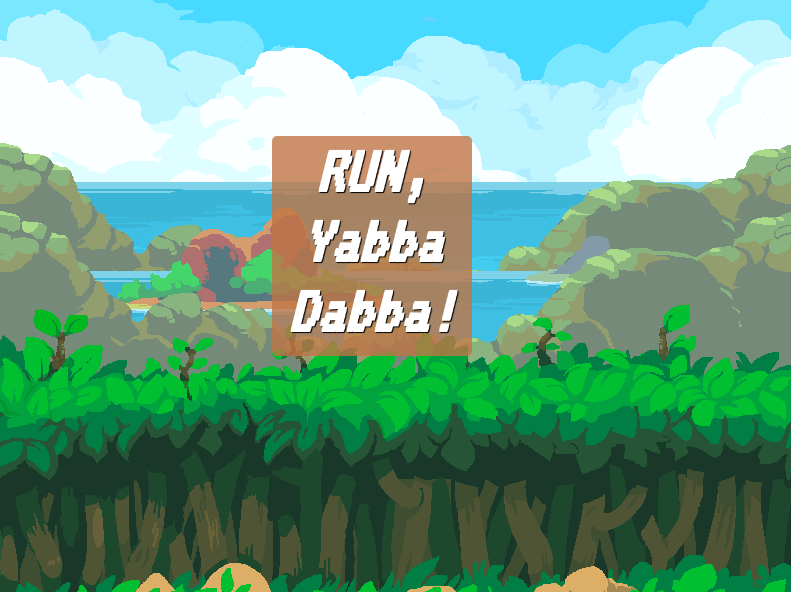
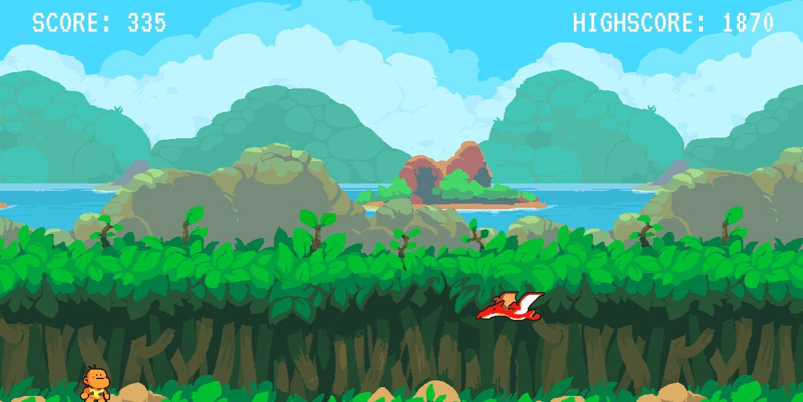

# RUN, Yabba Dabba!
RUN, Yabba Dabba é um endless Runner, 2D, casual para qualquer pessoa. 

Ajude Yabba Dabba a sobreviver na Era das Cavernas! 

# Game 

Você pode jogá-lo online clicando [aqui](http://tiny.cc/8hc9kz "aqui")!
OU, clone ou faça o download deste projeto, e abra o arquivo index.html no browser e divirta-se!

Para ter uma melhor experiência, jogue no Desktop ou Notebook. Este jogo ainda não é responsivo para outros tamanhos de tela. 

# Como jogar?

- Pressione Start para começar. 
- Cuidado com os inimigos! 
- Use as teclas direcionais do teclado.  
- Up para pular e Down para rolar.
- Sobreviva!

# Detalhes Técnicos
Esse jogo foi feito com:
- HTML Canvas, CSS e Vanilla JavaScript
- Sprites by [Superpowers](https://github.com/sparklinlabs/superpowers-asset-packs/tree/master/prehistoric-platformer "Superpowers") 

# Metas 
- Adicionar Música/Efeitos Sonoros
- Melhorar o Spawn de Inimigos 
- Novos personagens e desafios
- Novas animações
- Refatorar o código

# Saiba mais!
Quer conhecer um pouco mais sobre quem vos fala e sua jornada? Clique [aqui](http://tiny.cc/2fc9kz "aqui")!
